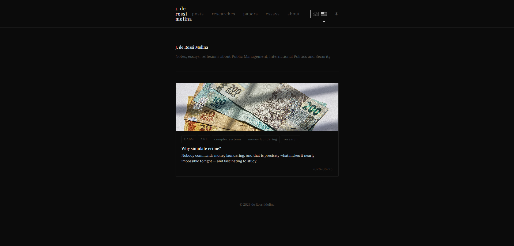
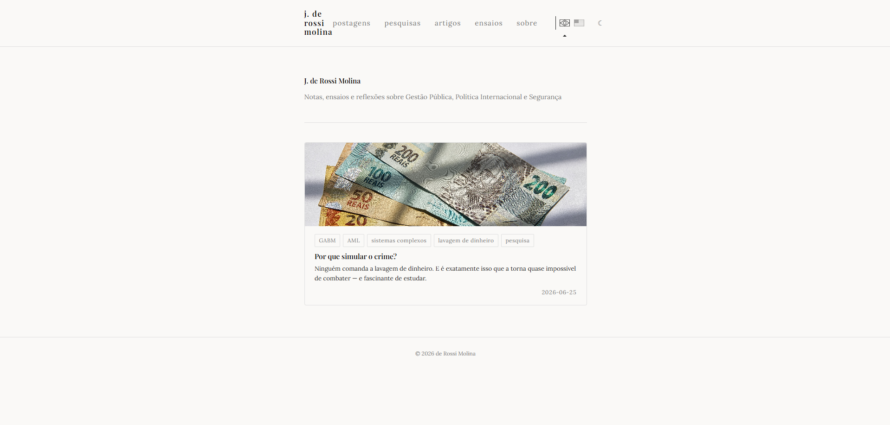

<p align="center">
  <strong>n o u s</strong><br>
  <em>a typography-first Hugo theme</em>
</p>

<p align="center">
  
  
  
</p>

---

Nous is a minimal Hugo theme for writers. No JavaScript frameworks, no build tools, no noise — just Playfair Display for headings, Lora for body text, and a single CSS file.

Built for personal blogs, academic writing, and essay collections.

## Preview

| Dark | Light |
|------|-------|
|  |  |

## Features

| | |
|-|-|
| **Dark / Light mode** | Toggle with persistence via localStorage |
| **Multilingual** | i18n-ready, tested with Portuguese and English |
| **Cookie consent** | Bilingual bar, dismissible, respects localStorage |
| **Copy attribution** | Pasted text automatically includes author credit |
| **Selection colors** | Yellow on dark, orange on light |
| **Highlight & underline** | `==word==` in red, `<u>word</u>` with red underline |
| **Responsive** | Single-column, mobile-friendly |
| **RSS** | Feed out of the box |
| **Zero dependencies** | One CSS file, vanilla JS, no build step |

## Quick start

### 1. Install

```bash
# Option A: submodule (recommended)
git submodule add https://github.com/derossimolina/nous-theme.git themes/nous

# Option B: clone
git clone https://github.com/derossimolina/nous-theme.git themes/nous
```

### 2. Configure

Add to your `hugo.toml`:

```toml
theme = "nous"

[params]
  shortTitle  = "Your Name"
  homeTitle   = "Your Name"
  homeContent = "A short description for the homepage"

[markup.goldmark.renderer]
  unsafe = true

[markup.goldmark.extensions.extras.mark]
  enable = true
```

### 3. Run

```bash
hugo server
```

## Full configuration

<details>
<summary>Expand full <code>hugo.toml</code> example</summary>

```toml
baseURL = "https://example.com/"
defaultContentLanguage = "pt"
title = "My Site"
theme = "nous"
paginate = 10

[params]
  description = "Notes, essays and reflections"
  shortTitle  = "J. Doe"
  homeTitle   = "J. Doe"
  homeContent = "Writing about things that matter"

[languages]
  [languages.pt]
    languageName = "Português"
    languageCode = "pt-BR"
    weight = 1
    [[languages.pt.menu.main]]
      name   = "postagens"
      url    = "/posts/"
      weight = 10
    [[languages.pt.menu.main]]
      name   = "ensaios"
      url    = "/essays/"
      weight = 20
    [[languages.pt.menu.main]]
      name   = "sobre"
      url    = "/about/"
      weight = 30

  [languages.en]
    languageName = "English"
    languageCode = "en-US"
    weight = 2
    [languages.en.params]
      description = "Notes, essays and reflections"
      homeContent = "Writing about things that matter"
    [[languages.en.menu.main]]
      name   = "posts"
      url    = "/posts/"
      weight = 10
    [[languages.en.menu.main]]
      name   = "essays"
      url    = "/essays/"
      weight = 20
    [[languages.en.menu.main]]
      name   = "about"
      url    = "/about/"
      weight = 30

[markup.goldmark.renderer]
  unsafe = true

[markup.goldmark.extensions.extras.mark]
  enable = true

[outputs]
  home = ["HTML", "RSS"]
```

</details>

## Content structure

```
content/
├── about.md              # default language
├── about.en.md           # english version
├── posts/
│   ├── my-post.pt.md
│   └── my-post.en.md
└── essays/
    ├── _index.pt.md      # section title (PT)
    ├── _index.en.md      # section title (EN)
    ├── my-essay.pt.md
    └── my-essay.en.md
```

## Writing extras

Nous extends standard Markdown with two visual accents for emphasis:

```markdown
This is ==highlighted text== in red.

This is <u>underlined text</u> with a red underline.
```

> Requires `[markup.goldmark.extensions.extras.mark] enable = true` and `[markup.goldmark.renderer] unsafe = true`.

## Customization

The entire theme is styled through CSS custom properties. Override them in your own stylesheet:

```css
:root {
  --bg:      #0b0b0b;   /* background        */
  --surface: #111111;   /* cards, code blocks */
  --border:  #1e1e1e;   /* dividers           */
  --text:    #c8c8c8;   /* body text          */
  --muted:   #555555;   /* secondary text     */
  --bright:  #ebebeb;   /* headings, hover    */
  --link:    #9a9a9a;   /* links              */
  --max:     660px;     /* content width      */
}
```

## Typography

| Element  | Font             | Weight |
|----------|------------------|--------|
| Headings | Playfair Display | 500    |
| Body     | Lora             | 400    |
| Code     | JetBrains Mono   | —      |

## License

[MIT](LICENSE) — use it, fork it, make it yours.

---

<p align="center">
  Made by <a href="https://derossimolina.github.io/">J. de Rossi Molina</a>
</p>
